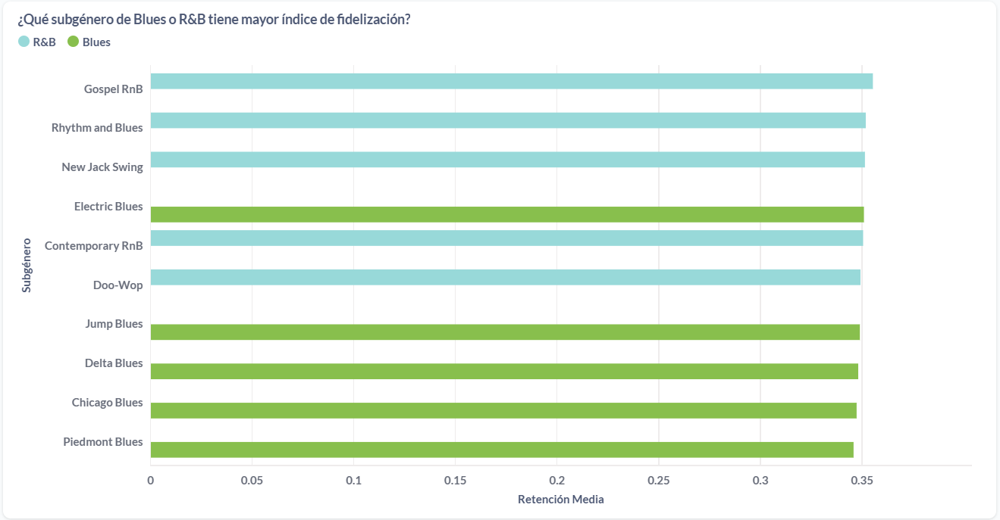
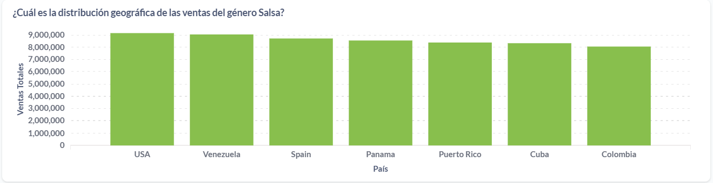
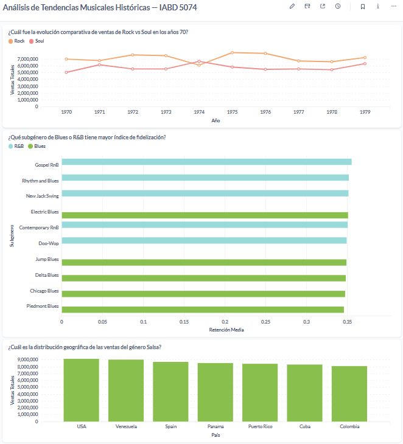

# Análisis de Tendencias Musicales Históricas mediante Ecosistemas de Contenedores

**Módulo 5074 — Sistemas de Big Data**  
**Curso de Especialización en Inteligencia Artificial y Big Data (IABD)**  
**Alumno:** Miguel Jerónimo Gutiérrez  
**Profesor:** Willman Acosta Lugo  
**Centro:** Campus Cámara Sevilla  

---

## Descripción del proyecto

Este proyecto simula un entorno real de Business Intelligence para el departamento de análisis de una gran discográfica. A partir de un dataset histórico simulado de ventas y reproducciones de LPs de los géneros Rock, Soul, R&B, Blues y Salsa durante las décadas de los 60, 70 y 80, se despliega una infraestructura completa basada en contenedores Docker para procesar, almacenar y visualizar los datos.

El objetivo es extraer valor de negocio respondiendo a tres preguntas clave mediante un cuadro de mandos funcional.

---

## Tecnologías utilizadas

| Tecnología | Versión | Función |
|---|---|---|
| Docker Desktop | Latest | Orquestación de contenedores |
| PostgreSQL | 15 | Base de datos relacional |
| Metabase | v0.49.6 | Herramienta BI y dashboard |
| Python | 3.11.9 | Generación, limpieza e ingesta de datos |
| pandas | 2.2.2 | Manipulación de datos |
| SQLAlchemy | 2.0.30 | ORM y conexión a base de datos |
| pg8000 | 1.31.2 | Driver PostgreSQL puro Python |
| faker | 25.2.0 | Generación de datos sintéticos |
| numpy | 1.26.4 | Generación aleatoria controlada |

---

## Arquitectura de contenedores

```
┌──────────────────────────────────────────────────────┐
│                  Windows 11 (host)                   │
│                                                      │
│  python etl_musica.py ──────────────────┐            │
│                                         │ pg8000     │
│  ┌──────────────────────────────────┐   │ :5455      │
│  │         Docker Desktop           │   │            │
│  │                                  │   │            │
│  │  ┌─────────────┐  red interna    │   │            │
│  │  │ PostgreSQL  │◄────────────────┼───┘            │
│  │  │ :5432       │    postgres:5432│                │
│  │  └─────────────┘                 │                │
│  │         ▲                        │                │
│  │         └──────── Metabase ──────┤                │
│  │                   :3000          │                │
│  └──────────────────────────────────┘                │
│                      ▲                               │
│               navegador :3000                        │
└──────────────────────────────────────────────────────┘
```

**Nota técnica:** El ETL Python se conecta a PostgreSQL por el puerto 5455 del host (el puerto 5432 está ocupado por una instalación nativa de PostgreSQL en Windows). Metabase se conecta a PostgreSQL por la red interna de Docker usando el nombre de servicio `postgres` y el puerto interno 5432.

---

## Estructura del repositorio

```
IABD_SistemasBigData_SubidaNota/
│
├── docker-compose.yml       # Orquesta PostgreSQL 15 + Metabase
├── etl_musica.py            # Script ETL: genera, limpia e inserta datos
├── requirements.txt         # Dependencias Python
├── README.md                # Este documento
├── .gitignore               # Exclusiones de Git
│
├── data/
│   ├── raw/                 # Dataset original con errores intencionados
│   └── processed/           # Dataset limpio post-ETL
│
├── screenshots/             # Capturas del dashboard y evidencias
│
└── docs/
    └── notas_tecnicas.md    # Decisiones de diseño justificadas
```

---

## Instrucciones de instalación y ejecución

### Requisitos previos

- Docker Desktop instalado y en ejecución
- Python 3.11 instalado
- Git instalado

### 1. Clonar el repositorio

```bash
git clone https://github.com/TU_USUARIO/IABD_SistemasBigData_SubidaNota.git
cd IABD_SistemasBigData_SubidaNota
```

### 2. Crear entorno virtual e instalar dependencias

```bash
python -m venv venv
venv\Scripts\Activate.ps1       # Windows PowerShell
pip install -r requirements.txt
```

### 3. Levantar los contenedores

```bash
docker compose up -d
```

Verificar que PostgreSQL está listo:

```bash
docker compose ps
```

Esperar hasta ver `(healthy)` en el servicio `sbg_postgres`.

### 4. Ejecutar el ETL

```bash
python etl_musica.py
```

El script ejecuta 7 bloques en secuencia:
1. Generación del dataset simulado con errores intencionados
2. Diagnóstico del dataset RAW
3. Limpieza y estandarización
4. Análisis básico post-limpieza
5. Conexión y creación de tabla en PostgreSQL
6. Inserción masiva (~50.000 registros)
7. Verificación final en base de datos

### 5. Acceder al dashboard

Abre el navegador y ve a:

```
http://localhost:3000
```

Credenciales de acceso: las configuradas durante la instalación de Metabase.

El dashboard **"Análisis de Tendencias Musicales Históricas — IABD 5074"** está disponible en la sección Dashboards.

### 6. Detener los contenedores

```bash
docker compose stop
```

Los datos persisten en el volumen `sbg_postgres_data` y estarán disponibles al volver a levantar con `docker compose up -d`.

---

## Limpieza de datos aplicada

El dataset simulado incluye intencionadamente los siguientes problemas de calidad, que el ETL resuelve de forma demostrable:

| Problema | Ejemplo | Solución aplicada |
|---|---|---|
| Variantes de género | `rock`, `ROCK`, `Rok` | Mapa de estandarización explícito |
| Formatos de fecha mixtos | `07/1975`, `1975` | Función `extraer_anio()` con 3 formatos |
| Valores nulos en streams | ~8% de registros | Imputación por mediana del género |
| Valores nulos en age_group | ~5% de registros | Imputación por moda global |
| Valores nulos en region | ~3% de registros | Rellenado con "Unknown" |
| Registros duplicados | ~2% de registros | `drop_duplicates()` con subset relevante |

El script muestra métricas de nulos antes y después de la limpieza, haciendo el proceso completamente trazable.

---

## Preguntas de negocio y respuestas del dashboard

### Pregunta 1 — ¿Cuál fue la evolución comparativa de ventas de Rock vs Soul en los años 70?


El gráfico de líneas muestra la evolución anual de ventas de Rock y Soul entre 1970 y 1979. Rock mantiene un volumen de ventas consistentemente superior a Soul durante toda la década, con ambos géneros mostrando una tendencia estable con ligeras fluctuaciones anuales.

### Pregunta 2 — ¿Qué subgénero de Blues o R&B tiene mayor índice de fidelización?



El gráfico de barras horizontales muestra la tasa de retención media por subgénero. Gospel RnB y Rhythm and Blues lideran la fidelización dentro de R&B, mientras que Electric Blues destaca dentro del Blues. La métrica utilizada es `retention_rate = repeat_buyers / unique_buyers`.

### Pregunta 3 — ¿Cuál es la distribución geográfica de las ventas del género Salsa?



El gráfico de barras muestra la distribución de ventas de Salsa por país. USA lidera en volumen de ventas, seguido de Venezuela, España y Panamá, reflejando tanto la diáspora latinoamericana como la penetración del género en mercados internacionales.

### Vista completa del dashboard



---

## Relación con Resultados de Aprendizaje

| RA | Descripción | Evidencia en este proyecto |
|---|---|---|
| **RA3** | Infraestructura de almacenamiento | `docker-compose.yml` con PostgreSQL 15, red interna `sbg_network`, volumen persistente `sbg_postgres_data`, healthcheck |
| **RA1** | Ingesta, procesamiento y análisis | `etl_musica.py` con 7 bloques: generación, errores intencionados, limpieza, análisis, inserción masiva de ~50.000 registros |
| **RA4** | Herramienta de visualización BI | Metabase v0.49.6 en contenedor Docker, conectado a PostgreSQL por red interna |
| **RA2** | Dashboard | 3 gráficos que responden explícitamente a las 3 preguntas de negocio |

---

## Posibles mejoras

- Añadir un servicio ETL en contenedor para que todo el pipeline corra dentro de Docker
- Implementar índices en PostgreSQL para optimizar las consultas del dashboard
- Ampliar el dataset con más décadas y géneros
- Añadir alertas en Metabase para detectar anomalías en ventas
- Configurar autenticación segura en PostgreSQL para entornos de producción

---

## Autor

**Miguel Jerónimo Gutiérrez**  
Curso de Especialización en Inteligencia Artificial y Big Data  
Campus Cámara Sevilla — 2025/2026
